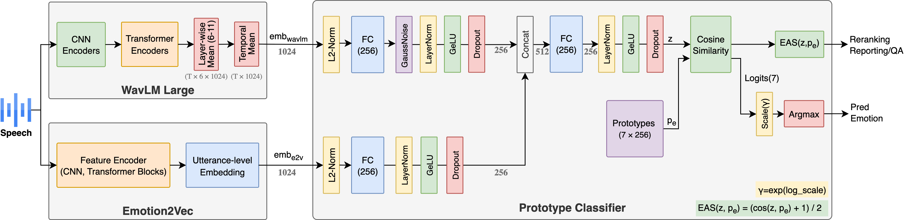
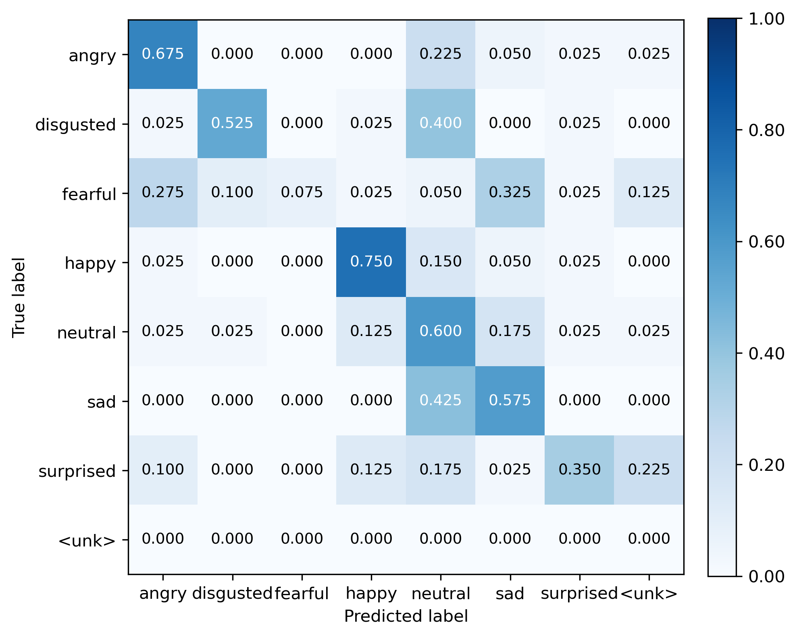
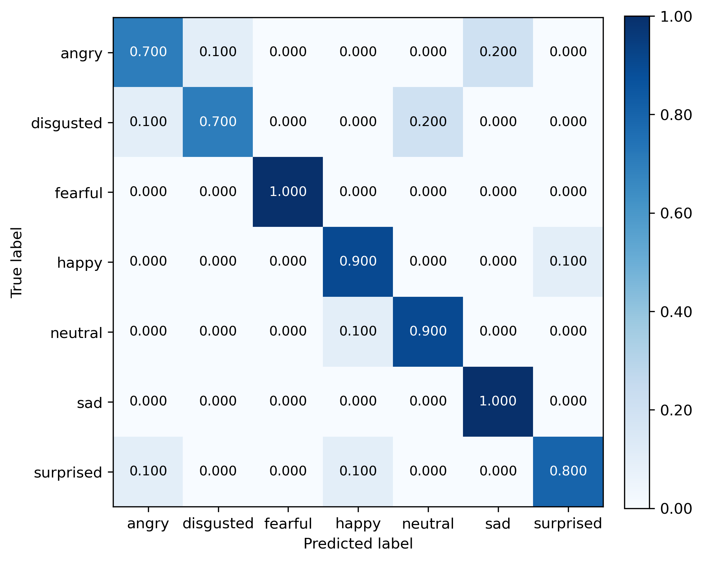
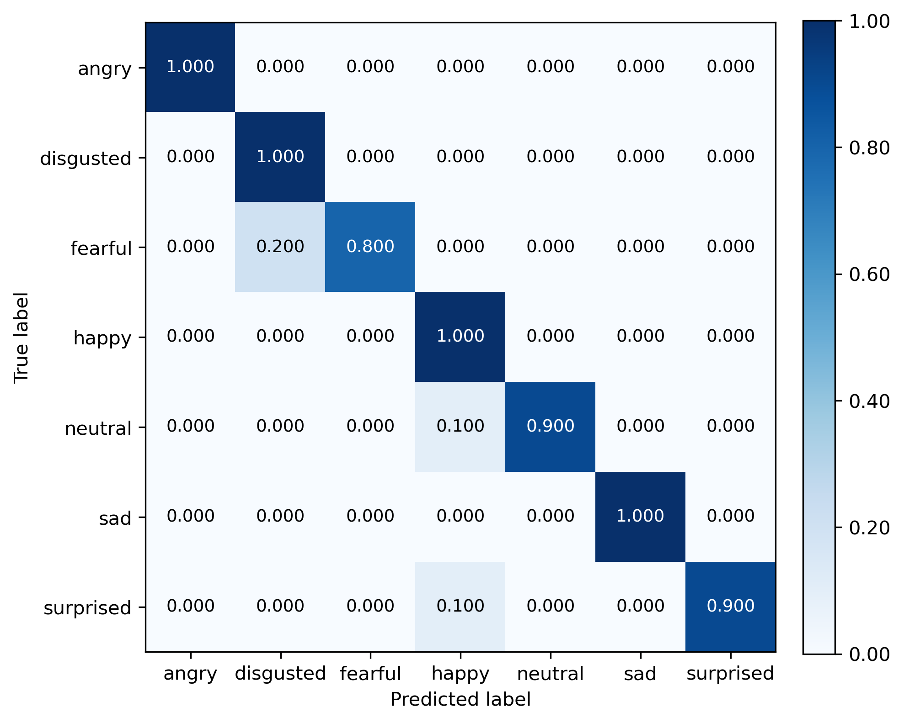
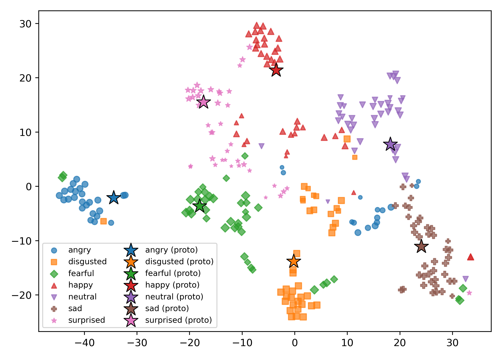
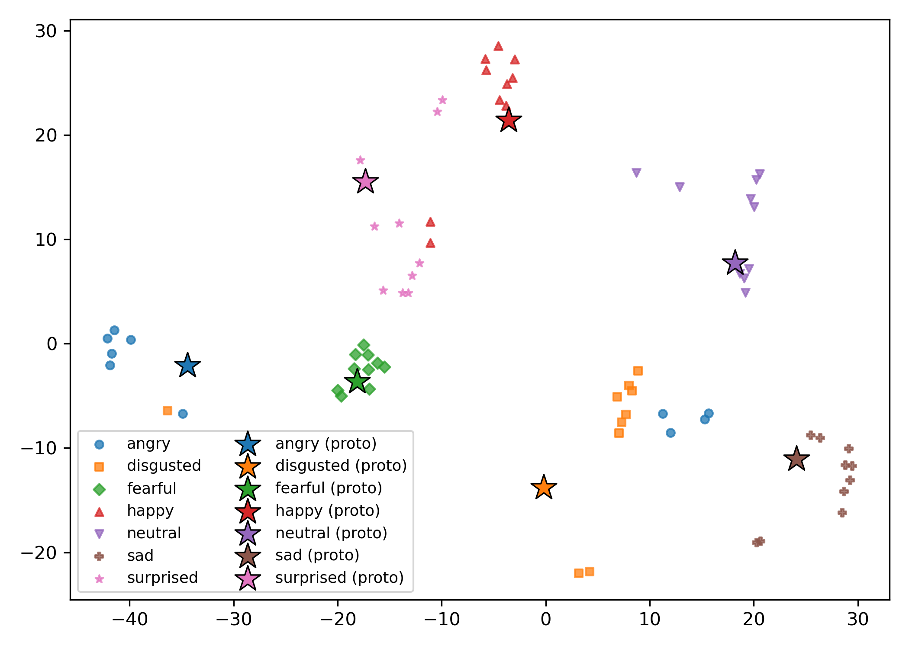
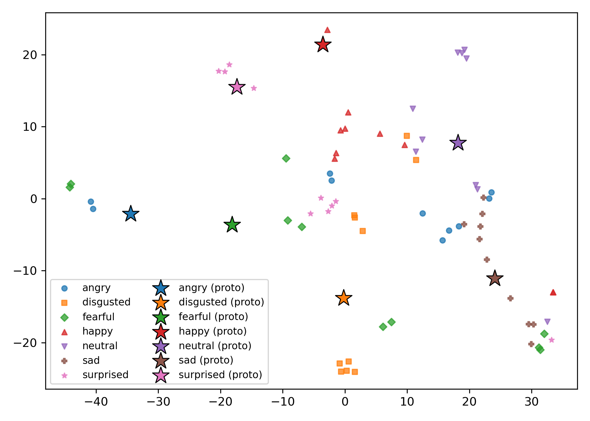
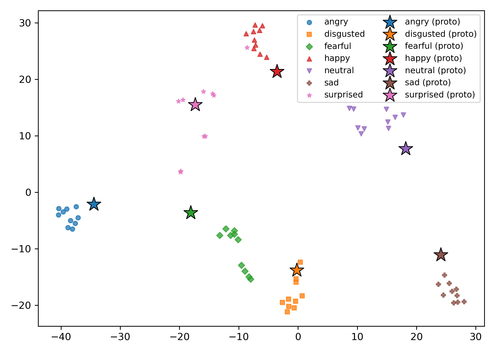
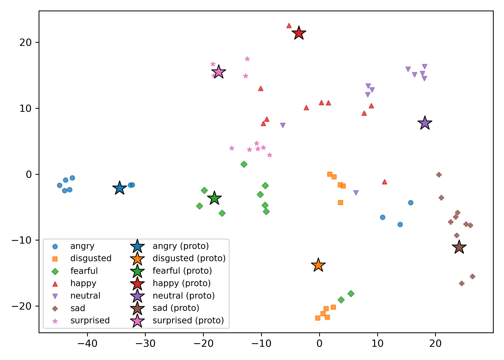

# Ground-Truth-Free Emotion Validation in Generative AI Speech

## 📌 Description

This repository contains the scripts and workflows used for validating emotions in synthetic speech 
generated by multiple TTS systems. The framework integrates **Emotion2Vec** and **WavLM** embeddings 
into a prototype-based classifier with the proposed **Emotion Adherence Score (EAS)**.

---


**Figure 1.** Proposed ground-truth-free validation framework.  

Input speech is encoded using WavLM Large, with embeddings derived via layer-wise averaging followed by temporal mean pooling, and Emotion2Vec, which provides utterance-level embeddings, each yielding 1024-dimensional feature representations. The resulting features are projected into a shared latent space, fused, and subsequently processed by a prototype-based classifier equipped with learnable emotion prototypes. This architecture produces both categorical emotion predictions and a continuous EAS, which serves as the basis for reranking and systematic evaluation.

---

## 📦 Requirements

This project uses Conda environments for reproducibility.  
Please create the environment matching your operating system:

### Linux
```bash
conda env create -f environment.linux.yml
```

### macOS
```bash
conda env create -f environment.macos.yml
```

Then activate:
```bash
conda activate gtfree-ser
```

---

## 🔄 Workflow Overview

1. **Dataset Preparation**  
   Build CSV files containing emotion labels and TTS-generated audio paths.  

2. **Embedding Extraction**  
   Compute embeddings (Emotion2Vec + WavLM).  

3. **Prototype-based Classifier Training**  
   Train the prototype-based classifier with fused embeddings.  

4. **Evaluation**  
   Evaluate trained model (standard metrics, per-class reports, TTS system-specific analysis).  

5. **Baseline Evaluation**  
   Compare results with the standalone Emotion2Vec baseline.

---

## 🚀 Usage

### 1. Build SER CSV
Generate train/validation splits from the TTS audio dataset:

```bash
python build_ser_csv.py \
    --emotion_csv emotion_sentences.csv \
    --tts_roots output/sentences/azure \
                output/sentences/cosyvoice2 \
                output/sentences/genai \
                output/sentences/openai \
    --train_out csv/train.csv \
    --val_out csv/val.csv \
    --val_ratio 0.2 \
    --seed 42 \
    --group_by text \
    --ensure_at_least_one_per_class
```

---

### 2. Prepare Embeddings
Extract **WavLM** and **Emotion2Vec** embeddings:

```bash
python prepare_embeddings.py
```

This will generate `.npy` embedding files and updated CSVs in `csv_with_emb_dual/`.

---

### 3. Train Prototype Classifier
Train the classifier with dual embeddings:

```bash
python proto_emotion_classifier.py \
    --mode train \
    --train_csv csv/csv_with_emb_dual/train.csv \
    --val_csv csv/csv_with_emb_dual/val.csv \
    --emb_mode both \
    --fusion projcat \
    --proto_ema 0.5 \
    --save_path proto_ckpt_dual.pt
```

---

### 4. Evaluation

#### Standard Evaluation
```bash
python proto_emotion_classifier.py \
    --mode eval \
    --val_csv csv/csv_with_emb_dual/val.csv \
    --emb_mode both \
    --fusion projcat \
    --load_path proto_ckpt_dual.pt \
    --report_path results/eval_report.json
```

#### TTS System-Specific Evaluation
```bash
python proto_emotion_classifier.py \
    --mode eval_tts \
    --val_csv csv/csv_with_emb_dual/val.csv \
    --emb_mode both \
    --fusion projcat \
    --load_path proto_ckpt_dual.pt \
    --report_path results/tts_eval_report.json
```

---

### 5. Baseline (Emotion2Vec only)

Run the standalone Emotion2Vec baseline classifier on the validation set:

```bash
python eval_emotion2vec.py \
    --csv_path csv/csv_with_emb_e2vplus/val.csv
```
This produces baseline classification metrics without using the prototype-based EAS model.

---

## Human Validation & Analysis

### 6.1 Dump EAS scores per validation sample

For each validation example, compute the **Emotion Adherence Score (EAS)** from the prototype-based classifier:

```bash
python proto_emotion_classifier.py --mode dump_eas \
    --val_csv csv/csv_with_emb_dual/val.csv \
    --emb_mode both \
    --fusion projcat \
    --load_path proto_ckpt_dual.pt \
    --batch_size 64 \
    --out_csv results/eas_scores.csv \
    --scale_eas_to_7
```

This generates `results/eas_scores.csv`, containing a per-utterance EAS value (scaled to a 1–7 range).

---

### 6.2 Dump Emotion2Vec baseline scores

Extract per-sample scores from the Emotion2Vec baseline for comparison:

```bash
python eval_emotion2vec.py --mode dump \
    --csv_path csv/csv_with_emb_dual/val.csv \
    --out_csv results/emotion2vec_scores.csv
```

This generates `results/emotion2vec_scores.csv` aligned with EAS outputs.

---

### 6.3 Correlation with Human Ratings

Compute correlation between human ratings and EAS:

```bash
python3 eas_human_correlation.py \
    --ratings_csv ratings_aggregated/ratings_average.csv \
    --eas_csv results/eas_scores.csv \
    --out_dir results/eas_human_corr
```

This script reports Pearson/Spearman correlations, confidence intervals, and per-emotion analysis.

---

### 6.4 Statistical Significance vs Baseline

Assess whether EAS significantly outperforms the Emotion2Vec baseline:

```bash
python sigtest_vs_baseline.py \
    --baseline_csv results/emotion2vec_scores.csv \
    --proposed_csv results/eas_scores.csv \
    --out_dir results/sigtest_out
```

This produces a detailed significance report (overall and per emotion).

---

## 📊 Outputs

- `eval_report.json` → overall performance metrics (accuracy, F1, precision, recall, EAS).  
- `tts_eval_report.json` → system-specific performance breakdown.  
- Confusion matrices and per-class reports (if enabled in scripts).  

---

## 📁 Key Files

- `emotion_sentences.csv`: Contains 70 sentences used as text prompts for TTS generation, with 10 sentences for each emotion
  (angry, disgusted, fearful, happy, neutral, sad, surprised).

- `generate_tts_azure.py`: Generates WAV files for all sentences using Azure Neural TTS with multiple speakers, saving them
  under `output/sentences/azure/`.

- `generate_tts_cosyvoice.py`: Generates WAV files using the CosyVoice2 TTS system with multiple speakers, saving them
  under `output/sentences/cosyvoice2/`.

- `generate_tts_genai.py`: Generates WAV files using a local/open-source TTS backend (e.g., EmotiVoice or another inference
  server), saving them under `output/sentences/genai/`.

- `generate_tts_openai.py`: Generates WAV files using OpenAI’s TTS models (e.g., `gpt-4o-mini-tts`) with different speakers
  and prompt templates, saving them under `output/sentences/openai/`.

All TTS scripts read from `emotion_sentences.csv` and create parallel emotional speech corpora for each TTS system, which are
later combined into training and evaluation CSVs for ground-truth-free SER.

---

## 📂 Directory Structure Overview

### `output/sentences/`
Contains all WAV files generated by different TTS systems.  
Each subfolder corresponds to a specific TTS engine and may include multiple speakers:

- `output/sentences/azure/`  
  WAV files generated using Azure Neural TTS.

- `output/sentences/cosyvoice2/`  
  WAV files generated using CosyVoice2.

- `output/sentences/genai/`  
  WAV files generated using a local/open-source TTS backend.

- `output/sentences/openai/`  
  WAV files generated using OpenAI TTS models

---

### `embeddings/`
Contains embedding vectors extracted from each utterance using two different SSL models:

- `embeddings/e2vplus/`  
  Emotion2Vec+ embeddings for all audio samples.

- `embeddings/wavlm_large/`  
  WavLM-Large embeddings for all audio samples.

These embeddings are used together (or individually) during classifier training and evaluation.

---

### `ratings/`
Contains human evaluation scores for the synthetic speech samples.  
These files include subjective ratings (emotional correctness, naturalness) collected from human participants
and are used to analyze the correlation between human perception and the Emotion Adherence Score (EAS).

Each rating CSV contains the following columns:

- `rater` — anonymized rater ID  
- `idx` — sentence index  
- `tts` — TTS system used (azure, cosyvoice2, genai, openai)  
- `emotion` — intended target emotion  
- `wav_path` — path to the evaluated audio file  
- `rating` — human score for emotional correctness  
- `naturalness` — human score for naturalness

---


---

## 📊 Experimental Results (Summary)

### Dataset Overview

The synthesized speech dataset spans four heterogeneous TTS systems, 20 speakers, 7 emotions, and 1,400 utterances:

| TTS System              | Speakers                              | Samples |
|-------------------------|----------------------------------------|---------|
| Azure Neural TTS        | Jenny, Davis, Guy, Aria, Sara         | 350     |
| CosyVoice2-0.5B         | nova, coral, echo, onyx, verse        | 350     |
| Gemini 2.5 Flash TTS    | zephyr, leda, fenrir, kore, charon    | 350     |
| GPT-4o-mini-tts         | nova, coral, echo, onyx, verse        | 350     |
| **Total**               | 20 speakers, 7 emotions                | **1,400** |

---

### Overall Validation Performance

Comparison between the proposed framework and the Emotion2Vec baseline on the validation set:

| Model       | Accuracy | Mean EAS | Macro Precision | Macro Recall | Macro F1 |
|------------|----------|----------|-----------------|--------------|----------|
| Emotion2Vec | 0.514   |   --     | 0.580           | 0.450        | 0.447    |
| Proposed    | 0.775   | 0.876    | 0.789           | 0.775        | 0.774    |

---

### System-Specific Validation Results

Validation performance across individual TTS systems:

| TTS System              | Accuracy | Mean EAS  |
|-------------------------|----------|-----------|
| Azure Neural TTS        | 0.857    | 0.8925    |
| CosyVoice2              | 0.586    | 0.8423    |
| Gemini 2.5 Flash TTS    | 0.943    | 0.8969    |
| GPT-4o-mini-tts         | 0.714    | 0.8697    |

---


### Ablation Study on Embedding Configurations

Impact of different embedding configurations on validation performance:

| Model                                | Accuracy | Mean EAS | Macro Precision | Macro Recall | Macro F1 |
|--------------------------------------|----------|----------|-----------------|--------------|----------|
| Emotion2Vec (E2V)                    | 0.593    | 0.939    | 0.604           | 0.593        | 0.584    |
| E2V + WavLM (L24)                    | 0.700    | 0.828    | 0.708           | 0.700        | 0.695    |
| E2V + WavLM (L4–L9)                  | 0.729    | 0.849    | 0.738           | 0.729        | 0.725    |
| E2V + WavLM (L6–L11)                 | 0.736    | 0.863    | 0.747           | 0.736        | 0.732    |
| E2V + WavLM (L10–L15)                | 0.775    | 0.876    | 0.789           | 0.775        | 0.774    |
| E2V + WavLM (L14–L19)                | 0.775    | 0.865    | 0.770           | 0.775        | 0.768    |
| E2V + WavLM (L18–L23)                | 0.764    | 0.866    | 0.775           | 0.764        | 0.759    |

---

### Per-Class Classification Report

#### Emotion2Vec Baseline

| Class      | Precision | Recall | F1-score |
|-----------|-----------|--------|----------|
| Angry     | 0.600     | 0.675  | 0.635    |
| Disgusted | 0.808     | 0.525  | 0.636    |
| Fearful   | 1.000     | 0.075  | 0.140    |
| Happy     | 0.714     | 0.750  | 0.732    |
| Neutral   | 0.296     | 0.600  | 0.397    |
| Sad       | 0.479     | 0.575  | 0.523    |
| Surprised | 0.737     | 0.350  | 0.475    |
| **Macro Avg** | **0.579** | **0.444** | **0.442** |
| **Accuracy**  |  \-      |  \-    | **0.507** |

#### Proposed Framework

| Class      | Precision | Recall | F1-score |
|-----------|-----------|--------|----------|
| Angry     | 0.865     | 0.800  | 0.831    |
| Disgusted | 0.776     | 0.950  | 0.854    |
| Fearful   | 0.735     | 0.625  | 0.676    |
| Happy     | 0.643     | 0.675  | 0.659    |
| Neutral   | 0.886     | 0.975  | 0.929    |
| Sad       | 0.837     | 0.900  | 0.868    |
| Surprised | 0.645     | 0.500  | 0.563    |
| **Macro Avg** | **0.770** | **0.775** | **0.768** |
| **Accuracy**  | –         | –      | **0.775** |

---

### Confusion Matrices

The following figures illustrate the confusion matrices for the baseline and proposed models:

<table>
  <tr>
    <td align="center">
      <br>
      Emotion2Vec baseline.
    </td>
    <td align="center">
      <br>
      Proposed framework.
    </td>
  </tr>
</table>

### System-Specific Confusion Matrices

The following figures illustrate the confusion matrices of the proposed framework evaluated separately on each TTS system:

<table>
  <tr>
    <td align="center">
      <br>
      <b>Azure Neural TTS</b><br>
      <sub>Most emotions are classified correctly, with perfect recognition of fearful and sad, and only mild confusions such as angry–disgusted, neutral–happy, and occasional spillover of surprised into neighboring high-arousal states.</sub>
    </td>
    <td align="center">
      <br>
      <b>CosyVoice2</b><br>
      <sub>Errors are more dispersed, with substantial confusion for fearful and surprised and noticeable leakage of angry and happy into adjacent negative or neutral states, consistent with this system's lower overall accuracy.</sub>
    </td>
  </tr>
  <tr>
    <td align="center">
      <br>
      <b>Gemini 2.5 Flash TTS</b><br>
      <sub>The almost perfectly diagonal structure, with only minor confusion between fearful and disgusted and occasional neutral/surprised spillover into happy, reflects the highest overall accuracy among the evaluated systems.</sub>
    </td>
    <td align="center">
      <br>
      <b>GPT-4o-mini-tts</b><br>
      <sub>Angry and disgusted are mostly well separated, whereas fearful and surprised often spread into other negative or high-arousal emotions, and happy–neutral pairs are frequently swapped, yielding an intermediate error profile.</sub>
    </td>
  </tr>
</table>

---
### t-SNE Visualizations

#### Fused Embedding Space


<br>

t-SNE projection of fused Emotion2Vec + WavLM embeddings (perplexity \(p=15\), cosine distance, PCA initialization). Points are colored by emotion, with learnable prototypes overlaid as distinct markers. The map reveals an isolated island for *angry* and a partially overlapping band for the remaining emotions, with neighborhoods such as *happy–surprised* and *fearful–sad*, mirroring the dominant confusion patterns observed in the classifiers.

#### System-Specific t-SNE Maps

The following t-SNE maps show the fused embedding space separately for each TTS system.

<table>
  <tr>
    <td align="center">
      <br>
      <b>Azure Neural TTS</b><br>
      <sub>t-SNE map colored by emotion, with prototypes overlaid as distinct markers. Clusters are reasonably well separated with moderate overlap, consistent with the strong but not perfect accuracy.</sub>
    </td>
    <td align="center">
      <br>
      <b>CosyVoice2</b><br>
      <sub>Emotion clusters are highly overlapping, especially among negative-valence classes, mirroring this system’s lower accuracy and higher 10-NN impurity.</sub>
    </td>
  </tr>
  <tr>
    <td align="center">
      <br>
      <b>Gemini 2.5 Flash TTS</b><br>
      <sub>Shows tight, well-separated clusters for all emotions, which aligns with the high accuracy and low impurity scores</sub>
    </td>
    <td align="center">
      <br>
      <b>GPT-4o-mini-tts</b><br>
      <sub>Intermediate structure between Gemini and CosyVoice2: angry, sad, and fearful are well formed, but there is notable overlap across happy, neutral, disgusted, and surprised, consistent with this model’s mid-range system-level accuracy.</sub>
    </td>
  </tr>
</table>

---

## 🧪 Human Validation Results

The correlation between the proposed **Emotion Adherence Score (EAS)** and human ratings  
(from 280 rated samples across 7 emotions) is summarized below.

### **Agreement Accuracy**
Fixed-midpoint threshold (≥4): **69.64%**  
(EAS scaled to 1–7 → threshold = 4.0, Human threshold = 4.0)

### **Overall Correlation**

**Overall Summary (n = 280):**
- **Pearson correlation (r):** 0.4448  
  - 95% CI: [0.3456, 0.5341]  
  - p-value: 5.24 × 10<sup>-15</sup> 
- **Spearman correlation (ρ):** 0.4307  
  - p-value: 4.49 × 10<sup>-14</sup>

### **Per Emotion**
| Emotion   | n  | Pearson r | 95% CI Low | 95% CI High | p-value      | Spearman ρ | p-value      |
|-----------|----|-----------|------------|-------------|--------------|------------|--------------|
| angry     | 40 | 0.701778  | 0.499454   | 0.831510    | 4.53e-07     | 0.723788   | 1.31e-07     |
| disgusted | 40 | 0.555122  | 0.294547   | 0.738863    | 2.01e-04     | 0.519164   | 5.98e-04     |
| fearful   | 40 | 0.601614  | 0.357012   | 0.769005    | 4.03e-05     | 0.550173   | 2.35e-04     |
| happy     | 40 | 0.453104  | 0.164865   | 0.670040    | 3.32e-03     | 0.396467   | 1.13e-02     |
| neutral   | 40 | 0.665610  | 0.446726   | 0.809313    | 2.78e-06     | 0.731969   | 8.01e-08     |
| sad       | 40 | 0.458894  | 0.171967   | 0.674048    | 2.90e-03     | 0.533880   | 3.88e-04     |
| surprised | 40 | 0.517204  | 0.245199   | 0.713723    | 6.32e-04     | 0.398402   | 1.09e-02     |

### **Macro Correlation (Fisher-z)**

- r<sub>macro</sub>=0.572  
- 95% CI [0.484, 0.648] (k=7, sum<sub>w</sub>=259.0)


## ⚖️ Comparison Against Baseline (Emotion2Vec Only)

A statistical comparison was performed between the proposed **Emotion Adherence Score (EAS)** classifier  
and the **Emotion2Vec-only baseline** using **McNemar’s exact test** and **bootstrap confidence intervals**.

### **Overall Comparison (N = 280)**

- **Accuracy:**  
  - Baseline: **51.43%**  
  - Proposed (EAS): **77.50%**  
  - **Δ = +26.07 percentage points**  

- **Macro F1-score:**  
  - Baseline: **0.5109**  
  - Proposed (EAS): **0.7736**  
  - **Δ = +0.2626**

- **Statistical significance:**  
  - McNemar exact: **b = 5**, **c = 78**, **p = 6.404 × 10<sup>-18</sup>**  
  - Bootstrap 95% CI for ΔAccuracy: **[20.71, 31.79] pp**  
  - Bootstrap 95% CI for ΔMacro-F1: **[0.2095, 0.3170]**

### **Per-Emotion Results (McNemar Exact Test)**

| Emotion   | n  | Acc (Base) | Acc (Prop) | ΔAcc  | F1 (Base) | F1 (Prop) | ΔF1     | b | c  | p-value       |
|-----------|----|------------|------------|-------|-----------|-----------|---------|---|----|---------------|
| angry     | 40 | 0.675      | 0.750      | 0.075 | 0.1151    | 0.1224    | 0.0073  | 1 |  4 | 3.75e-01      |
| disgusted | 40 | 0.525      | 0.825      | 0.300 | 0.0984    | 0.1292    | 0.0308  | 0 | 12 | 4.88e-04      |
| fearful   | 40 | 0.075      | 0.650      | 0.575 | 0.0199    | 0.1126    | 0.0926  | 0 | 23 | 2.38e-07      |
| happy     | 40 | 0.775      | 0.775      | 0.000 | 0.1247    | 0.1247    | 0.0000  | 2 |  2 | 1.00e+00      |
| neutral   | 40 | 0.600      | 0.850      | 0.250 | 0.1071    | 0.1313    | 0.0241  | 1 | 11 | 6.35e-03      |
| sad       | 40 | 0.600      | 0.925      | 0.325 | 0.1071    | 0.1373    | 0.0301  | 1 | 14 | 9.77e-04      |
| surprised | 40 | 0.350      | 0.650      | 0.300 | 0.0741    | 0.1126    | 0.0385  | 0 | 12 | 4.88e-04      |

These results demonstrate that the proposed **EAS-based classifier significantly outperforms**  
the baseline Emotion2Vec-only system across nearly all emotions.

## ✍️ Citation

If you use this code or methodology in your research, please cite our paper:

```bibtex
@misc{Ozcan2025SER,
  author       = {Ahmet Remzi Ozcan and Figen G. Alper},
  title        = {A Ground-Truth-Free Framework for Validating Emotions in Generative AI Speech Synthesis},
  year         = {2025},
  howpublished = {\url{https://github.com/arozcan/ground-truth-free-ser}},
  note         = {Accessed: 2025-10-04}
}
```

---

## 📬 Contact

For questions, please contact:

- **Ahmet Remzi Özcan** – ahmet.ozcan@btu.edu.tr